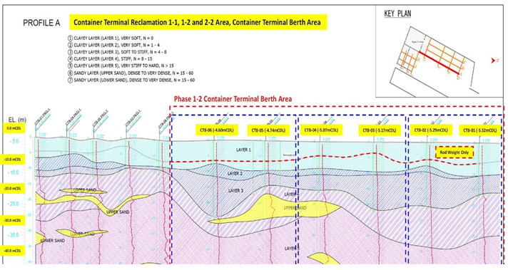

Tanah Lunak (Soft Marine Clay)
	Tanah lunak, khususnya lempung laut (soft marine clay), didefinisikan sebagai tanah lempung yang memiliki kuat geser undrained (su) yang rendah, kadar air alami (Wn) yang tinggi, dan permeabilitas (k) yang sangat kecil. 
Tabel 2.1 Korelasi N-SPT dengan Kohesi Tanah Kohesif
N-SPT	Konsistensi	Kohesi Undrained (kN/m2)
<2	Very soft	<12,5
2-8	Soft to medium	12,5-40
8-15	Stiff	40-75
15-30	Very stiff	75-200
>30	Hard	>200
	Menurut Rachlan (1986) dan Bima Marga (1999), tanah lunak adalah tanah yang terdiri dari tanah lempung yang memiliki kadar air yang tinggi, permeabilitas rendah, kompresibilitas tinggi dan secara visual dapat ditembus dengan ibu jari, minimum sedalam 25 mm. Tanah lunak umumnya ditandai dengan nilai N-SPT (Standard Penetration Test) yang sangat rendah, berdasarkan korelasi yang ada (Lihat Tabel 1), nilai N-SPT berkisar antara 0–2 menunjukkan konsistensi very soft dengan kohesi undrained (cu) kurang dari 12,5 kN/m2. Tanah lunak menunjukkan perilaku kompresibilitas yang sangat tinggi sehingga respons terhadap pembebanan sangat dipengaruhi oleh proses konsolidasi (Guangdong, 2024).
	Kondisi tanah lunak di area reklamasi Pelabuhan Patimban menunjukkan karakteristik tipikal lempung marin pesisir dengan stratigrafi berlapis. Berdasarkan profil tanah yang ditunjukkan pada Gambar 2.1, area Container Terminal Berth memiliki lapisan lempung lunak (Layer 1 hingga Layer 5) dengan ketebalan total mencapai 25-30 meter. Layer 1 merupakan lapisan paling lunak dengan nilai N-SPT mendekati 0 (very soft), diikuti Layer 2 dengan N-SPT antara 1-4 (very soft), Layer 3 dengan N-SPT 4-8 (soft to stiff), Layer 4 dengan N-SPT 8-15 (stiff), dan Layer 5 dengan N-SPT >15 (very stiff to hard). Di bawah lapisan lempung lunak tersebut terdapat lapisan pasir (Upper Sand dan Lower Sand) dengan nilai N-SPT berkisar 15-60 yang berfungsi sebagai lapisan pendukung (bearing stratum). Profil stratigrafi ini menunjukkan adanya gradasi kekuatan tanah dari kondisi sangat lunak di permukaan hingga relatif keras pada kedalaman yang lebih dalam (Phuong et al., 2024).

[GAMBAR 2.1: Profil Stratigrafi Tanah di Area Container Terminal Berth]
Sumber: Phuong et al. (2024)
